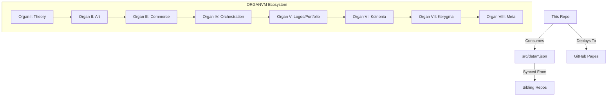

# Portfolio — Anthony James Padavano

<div align="center">
  
  <h3>The central node of an Eight-Organ Creative-Institutional System.</h3>
  
  [](https://4444j99.github.io/portfolio/)
  [](https://github.com/4444j99/portfolio/actions/workflows/quality.yml)
  [](LICENSE)
</div>

---

## 🔭 Overview

Personal portfolio site showcasing 20 project case studies, an interactive p5.js generative hero, and a live engineering dashboard. The project is organized around the **ORGANVM** system—a polymathic framework spanning 91 repositories and 8 GitHub organizations.

*   **Live Hub:** [4444j99.github.io/portfolio](https://4444j99.github.io/portfolio/)
*   **Architecture:** [The Eight-Organ System](https://github.com/meta-organvm)


---

## 🛠️ Tech Stack

- **Frontend:** [Astro 5](https://astro.build/) (Static Site Generation)
- **Data Viz:** [D3.js](https://d3js.org/) & [p5.js](https://p5js.org/)
- **State:** JSON-driven architecture (`src/data/`)
- **Type Safety:** TypeScript (Strict Mode)
- **Styling:** Scoped CSS (No framework)
- **Search:** [Pagefind](https://pagefind.app/) (Static Indexing)

---

## 🏗️ System Architecture

This repository acts as the **Logos** (Organ V) node, coordinating data and vitals from across the system.



---

## 💎 Quality Infrastructure

We enforce a rigorous **Quality Ratchet** system via custom automation.

| Pillar | Metric | Goal |
| :--- | :--- | :--- |
| **Performance** | Lighthouse Score | 100 |
| **Accessibility** | axe-core Coverage | 100% |
| **Security** | `npm audit` / Dependabot | 0 Vulnerabilities |
| **Integrity** | Link Checking | 0 Broken Links |
| **Stability** | CI Green Runs | 5 Consecutive |

<details>
<summary><b>View Detailed Quality Policy</b></summary>

### Performance Budgets
Lighthouse CI enforcement: Perf ≥ 90, A11y ≥ 91, BP ≥ 93, SEO ≥ 92.

### Ratchet Schedules
Coverage ratchet policy: W2 `12/8/8/12`, W4 `18/12/12/18`, W6 `25/18/18/25`, W8 `35/25/25/35`, W10 `45/32/32/45`, W12 `55/40/40/55` (Statements/Branches/Functions/Lines). Active phase: W12.

Typecheck hint budget policy: W2 `<=20`, W4 `<=8`, W6 `=0`, W8 `=0`, W10 `=0`, W12 `=0`.

Runtime a11y coverage ratchet: 100% enforcement (reached).

Security ratchet checkpoints: `2026-02-21` `moderate<=5, low<=4`, `2026-02-28` `moderate<=2, low<=2`, `2026-03-07` `moderate<=1, low<=1`, `2026-03-14` `moderate<=0, low<=0`, `2026-03-18` `moderate<=0, low<=0`.

</details>

---

## 🚀 Usage

### Prerequisites
- Node.js `>= 22.19.0`
- npm

### Installation
```bash
git clone https://github.com/4444j99/portfolio
cd portfolio
npm install
```

### Key Commands

**Development & Building**
- `npm run dev` — Syncs vitals and starts the Astro development server.
- `npm run build` — Generates badges, syncs data, builds the static site, and generates the Pagefind search index.
- `npm run preview` — Previews the production build locally.

**Quality & Testing**
- `npm run lint` — Runs the Biome linter.
- `npm run lint:fix` — Runs the Biome linter and applies safe fixes.
- `npm run typecheck` — Runs Astro type checking.
- `npm run test` — Runs the Vitest test suite.
- `npm run preflight` — Runs linting, strict typechecking, build, validation, and tests.
- `npm run quality:local` — Runs the comprehensive local quality ratchet (security, testing, and core quality checks).

**Data Operations**
- `npm run generate-data` — Regenerates system metrics and portfolio data.
- `npm run sync:content` — Syncs content from the praxis source.
- `npm run sync:identity` — Syncs identity data.
- `npm run sync:omega` — Syncs omega configuration.
- `npm run sync:vitals` — Syncs trust metrics and system vitals.

### Consult API (Cloudflare Worker)

The consult page uses a Cloudflare Worker endpoint for server-side analysis. The API is managed via:
- `npm run consult:worker:dev` — Starts local worker development.
- `npm run consult:worker:deploy` — Deploys the worker to Cloudflare.
- `npm run consult:worker:migrate:local` — Applies D1 database migrations locally.
- `npm run consult:worker:migrate:remote` — Applies D1 database migrations remotely.

1. Set up and deploy the worker in [`workers/consult-api/README.md`](workers/consult-api/README.md).
2. Set `PUBLIC_CONSULT_API_BASE` to your worker origin (for example, `https://portfolio-consult-api.<subdomain>.workers.dev`).
3. Redeploy the Astro site.

If `PUBLIC_CONSULT_API_BASE` is not set, the consult page still works using deterministic fallback analysis.

---

## 📜 Documentation

- [Operative Handbook](docs/the-operative-handbook.md)
- [Evaluation to Growth Report](docs/evaluation-to-growth-report.md)
- [Social Launch Kit](docs/social-launch-kit.md)

---

## 🤝 Community

- [Contributing](.github/CONTRIBUTING.md)
- [Security Policy](.github/SECURITY.md)
- [Support](.github/SUPPORT.md)

---

## 💰 Support & Funding

Enjoying the work? Support development through:

- **[GitHub Sponsors](https://github.com/sponsors/4444J99)** — Direct recurring support
- **[Payrail](https://payrail.ivixivi.workers.dev/pay)** — One-time or flexible contributions

Your support fuels the ORGANVM ecosystem and keeps these tools free and open.

## ⚖️ License

Distributed under the MIT License. See `LICENSE` for more information.
