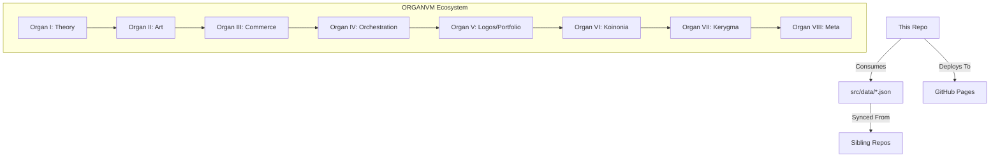

# Portfolio — Anthony James Padavano

<div align="center">
  
  <h3>The central node of an Eight-Organ Creative-Institutional System.</h3>
  
  [](https://organvm.github.io/portfolio/)
  [](https://github.com/organvm/portfolio/actions/workflows/ci.yml)
  [](LICENSE)
</div>

---

## 🔭 Overview

Personal portfolio site showcasing 19 project case studies, an interactive p5.js generative hero, and a live engineering dashboard. The project is organized around the **ORGANVM** system—a polymathic framework spanning 171 repositories and 8 GitHub organizations.

*   **Live Hub:** [organvm.github.io/portfolio](https://organvm.github.io/portfolio/)
*   **Architecture:** [The Eight-Organ System](https://github.com/meta-organvm)


---

## 🛠️ Tech Stack

- **Frontend:** [Astro 5](https://astro.build/) (Static Site Generation)
- **Data Viz:** [D3.js](https://d3js.org/) & [p5.js](https://p5js.org/)
- **State:** JSON-driven architecture (`src/data/`)
- **Type Safety:** TypeScript (Strict Mode)
- **Styling:** Scoped CSS (No framework)
- **Search:** [Pagefind](https://pagefind.app/) (Static Indexing)

---

## 🏗️ System Architecture

This repository acts as the **Logos** (Organ V) node, coordinating data and vitals from across the system.



---

## 💎 Quality Infrastructure

We enforce a rigorous **Quality Ratchet** system via custom automation.

| Pillar | Metric | Goal |
| :--- | :--- | :--- |
| **Performance** | Lighthouse Score | 100 |
| **Accessibility** | axe-core Coverage | 100% |
| **Security** | `npm audit` / Dependabot | 0 Vulnerabilities |
| **Integrity** | Link Checking | 0 Broken Links |
| **Stability** | CI Green Runs | 5 Consecutive |

<details>
<summary><b>View Detailed Quality Policy</b></summary>

### Performance Budgets
Lighthouse CI enforcement: Perf ≥ 90, A11y ≥ 91, BP ≥ 93, SEO ≥ 92.

### Ratchet Schedules
Coverage ratchet policy: W2 `12/8/8/12`, W4 `18/12/12/18`, W6 `25/18/18/25`, W8 `35/25/25/35`, W10 `45/32/32/45`, W12 `55/40/40/55` (Statements/Branches/Functions/Lines). Active phase: W12.

Typecheck hint budget policy: W2 `<=20`, W4 `<=8`, W6 `=0`, W8 `=0`, W10 `=0`, W12 `=0`.

Runtime a11y coverage ratchet: 100% enforcement (reached).

Security ratchet checkpoints: `2026-02-21` `moderate<=5, low<=4`, `2026-02-28` `moderate<=2, low<=2`, `2026-03-07` `moderate<=1, low<=1`, `2026-03-14` `moderate<=0, low<=0`, `2026-03-18` `moderate<=0, low<=0`.

</details>

---

## 🚀 Usage

### Prerequisites
- Node.js >= 22
- npm

### Install

```bash
git clone https://github.com/organvm/portfolio
cd portfolio
npm install
```

### Development

```bash
npm run dev          # sync:vitals, then astro dev → localhost:4321/portfolio/
npm run lint:fix     # Biome autofix (tabs, single quotes, trailing commas, width 100)
npm run preflight    # Pre-push gate: lint → typecheck:strict → build → validate → sync:a11y-routes → test
```

### Build & Preview

```bash
npm run build        # generate-badges → sync:vitals → sync:omega → sync:identity → astro build → pagefind
npm run preview      # Serve the built dist/
```

### Tests

```bash
npm run test           # Vitest unit + integration
npm run test:watch     # Vitest in watch mode
npm run test:coverage  # Coverage report (V8 provider)

# Require npm run build first:
npm run test:a11y            # axe-core audit on built HTML
npm run test:e2e:smoke       # Playwright smoke (mobile + desktop viewports)
npm run test:runtime:errors  # Runtime error telemetry

# Workspace packages (Node built-in test runner, not Vitest):
npm run test:github-pages-core
npm run test:quality-ratchet-kit
npm run test:shibui-rhetoric
npm run test:sketches
```

### Data Sync

```bash
npm run sync:vitals       # .quality/*.json → vitals.json, trust-vitals.json, landing.json
npm run sync:omega        # targets.json → omega.json (maturity scorecard)
npm run sync:identity     # system-metrics.json → about.json
npm run sync:a11y-routes  # Rebuild route manifest after adding/removing pages or personas
npm run generate-data     # Regenerate src/data/ from sibling Python repo
```

### Strike Intelligence Engine

Requires the `gemini` CLI. Falls back to `[DRAFT]` templates when unavailable.

```bash
# Create a strike target (defaults to systems-architect persona)
npm run strike:new "Company Name" "Role Title"

# Specify a persona from src/data/personas.json
npm run strike:new "Company Name" "Role Title" "persona-id"

# AI-discover candidates per persona → src/data/scout-candidates.json
npm run strike:scout

# Batch-process intake/job-descriptions/ directory
npm run strike:sweep
```

After `strike:new`, the tailored landing page appears at `/portfolio/for/<slug>` and `npm run build:resume` generates the PDF.

### Quality Pipeline

```bash
npm run quality:local:no-lh  # Full CI-parity: security → lint → typecheck:strict → build → all tests → badges → verify
npm run quality:local        # Same + Lighthouse (requires Chrome)
```

### Consult Worker (Cloudflare)

The `/consult` page POSTs to a Cloudflare Worker backed by D1. When `PUBLIC_CONSULT_API_BASE` is unset the page falls back to deterministic capability analysis.

```bash
npm run consult:worker:dev             # Local dev via wrangler --remote (requires CF auth)
npm run consult:worker:deploy          # Deploy worker to Cloudflare
npm run consult:worker:migrate:remote  # Apply D1 migrations to production
```

Set `PUBLIC_CONSULT_API_BASE` to your worker origin (e.g. `https://portfolio-consult-api.<subdomain>.workers.dev`) in the Astro deployment environment before building. Full API contract: [`workers/consult-api/README.md`](workers/consult-api/README.md).

### Resume PDFs & QR Codes

```bash
npm run build:resume  # Render per-persona resume YAML → PDF
npm run build:qr      # Generate QR codes
```

---

## 📜 Documentation

- [Operative Handbook](docs/the-operative-handbook.md)
- [Evaluation to Growth Report](docs/evaluation-to-growth-report.md)
- [Social Launch Kit](docs/social-launch-kit.md)

---

## 🤝 Community

- [Contributing](.github/CONTRIBUTING.md)
- [Security Policy](.github/SECURITY.md)
- [Support](.github/SUPPORT.md)

---

## 💰 Support & Funding

Enjoying the work? Support development through:

- **[GitHub Sponsors](https://github.com/sponsors/4444J99)** — Direct recurring support
- **[Payrail](https://payrail.ivixivi.workers.dev/pay)** — One-time or flexible contributions

Your support fuels the ORGANVM ecosystem and keeps these tools free and open.

## ⚖️ License

Distributed under the MIT License. See `LICENSE` for more information.
